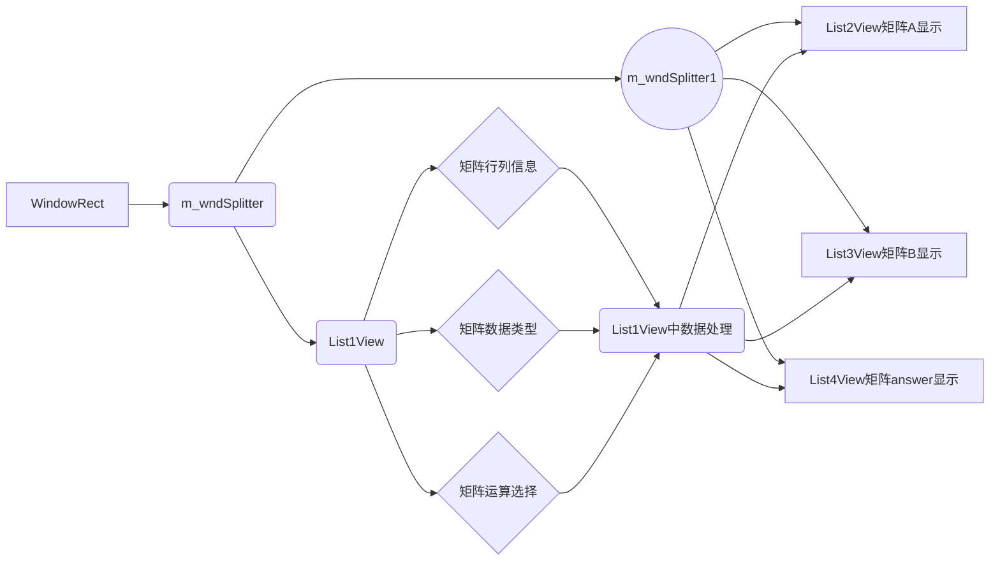

# SimpleMFCMatrixCalculator

* Last Updated on September 2th
* Include Simple Matrix operation functions


##设计文档

### 设计任务

用VC6.0编写MFC单文档矩阵运算程序，基本要求如下：

* 要求能够分别产生两个矩阵
* 分栏设计显示矩阵
* 矩阵运算功能基本要求：
  * 左乘
  * 右乘
  * 点乘
  * 矩阵减法
  * 矩阵加法
  * 矩阵转置
* 内核矩阵库使用模板类编写

### 任务分析

1. 该如何实现分栏的功能？
2. 完成分栏之后该如何实现不同栏目之间数据的交互？
3. 点乘应该以怎样的形式体现？
4. 模板类应该适应怎样的数据实例？
5. 矩阵的输入方式和输出显示应该如何选择？

### 设计思路与流程

1. 主框架
   1. MFC层采用MFC单文档应用程序的默认框架结构,传统框架:

* CAboutDlg ：  对话框框类，对应应用程序的“帮助”->“关于”菜单,弹出“关于”对话框。
* CMatrixOperationApp： 派生自CWinApp , 为应用程序对象，负责应用程序的初始化和退出的清理工作。
* CMainFrame：  派生自CFrameWnd类, 为框架窗口对象,对应应用程序的主窗口。
* CMatrixOperationView： 派生自视图类CView ,为视图对象,对应应用程序的客户窗口,用来显示文档数据。
* CMatrixOperationDoc： 派生自CDocument文档类,为文档对象,储存于应用程序相关的数据,在应用中没有直观的对应关系。
  2. 在单文档中将主视图分栏，总体分成了上下两栏，下面一栏又分为3栏分别显示矩阵。
  3. 内核库使用win32控制台程序项目建立的Matrix模板类，经过功能测试后移植到MFC应用程序中。

2. 程序编写流程：

* 界面设计：内核库接口设计需要与MFC层的需求相适应，所以这里从比较陌生的MFC矩阵运算界面分栏开始。在界面设计中将矩阵运算、生成、显示分别与不同的操作相关联，完成View, MainFrame以及不同View之间数据交互的设计与体现。
* 功能设计：封装矩阵数据类型，包含基本要求里相关的运算，同时提供output成员函数来作为输出接口，将矩阵转换成能在EditBox中输出的形式。
* 错误处理：针对可能出现的矩阵运算的逻辑错误逐个处理，在结果框中给出错误信息。


### 功能介绍

界面设计以及功能按钮截图如下：


1. **矩阵行列宽度的设置**

   可以通过设置矩阵A,B的行宽点击Generate按钮来在对应栏目的编辑框中产生新的矩阵，其中特殊之处在于，如果输入的矩阵是一行一列的话，则认为此矩阵是一个数，可以用于DotPt即为点乘的运算。

2. **矩阵乘法**

   完成矩阵的生成之后可以进行两者之间的乘法运算，矩阵乘法运算在此处分为两类，左乘和右乘，需要矩阵A,B分别满足A的列数等于B的行数和A的行数等于B的列数的条件，否则会在第三个矩阵显示的编辑框中显示错误信息,1 * 1的矩阵看做一个数。但在有 ,1 * 1矩阵的情况下进行矩阵乘法的运算仍然会当作矩阵来处理。

3. **矩阵点乘**

   需要输入的两个矩阵中至少有一个矩阵是1 * 1的，作为单独的数起作用，若不符合条件则会在第三个矩阵显示的编辑框中给出错误信息。

4. **矩阵加法/减法**

   矩阵加法要求两个矩阵大小相同，否组会给出错误信息。

5. **矩阵转置**

   对第三个矩阵显示的标记框中最后一次合法运算结果产生的矩阵进行转置操作并显示。

6. **类型的选择**

   **设计了int 和 double两种数据类型作为矩阵模板类实例化的类型，特别记录了矩阵A和矩阵B分别生成时数据类型的选择TypeA, TypeB, 控制任何时候两者的运算都要建立在数据类型相同的基础之上，防止出现类型不同导致的错误。**

### 文件与对象描述

各栏目之间的关系和数据交互如下：




没有使用MFC架构之外的外部库，完全在MFC框架平台上进行开发。

CMainFrame类中相关的成员：

// Attributes
public:

```c++
CSplitterWnd m_wndSplitter;//用于分割上下栏
CSplitterWnd m_wndSplitter1;//用于将下栏分割成三栏
CString MatrixACString;//用于矩阵A输出形式的中间存储
CString MatrixBCString;//用于矩阵B输出形式的中间存储
CString MatrixAnswerCString;//用于答案矩阵输出形式的中间存储
```
// Operations
public:
```c++
virtual BOOL OnCreateClient(LPCREATESTRUCT lpcs, CCreateContext* pContext);//创建窗口
void Answer();//空
void MatrixA(CString);//用于中间存储矩阵A输出形式并传递给List2View显示
void MatrixB(CString);//用于中间存储矩阵B输出形式并传递给List3View显示
void ViewAnswer(CString);//用于中间存储矩阵B输出形式并传递给List4View显示
```
CList1View类中相关的成员：

public:

```c++
//{{AFX_DATA(CList1View)
enum { IDD = IDD_DIALOG1 };//关联对话框IDD_DIALOG1
CString	m_ROWA;//A的行数
CString	m_ROWB;//B的行数
CString	m_COLUMNA;//A的列数
CString	m_COLUMNB;//B的列数
//}}AFX_DATA
```

// Attributes
public:
```c++
CMatrix<int> intA;//用于存储int型矩阵A实例
CMatrix<int> intB;//用于存储int型矩阵B实例
CMatrix<double> doubleA;//用于存储double型矩阵A实例
CMatrix<double> doubleB;//用于存储double型矩阵B实例
CMatrix<int> intrt;//用于存储int型矩阵运算后结果
CMatrix<double> doublert;//用于存储double型矩阵运算后结果
int m_TYPE;//用于存储矩阵类型
int typeA;//记录矩阵A产生时的数据类型
int typeB;//记录矩阵B产生时的数据类型
CString ERR;//记录错误消息
```
//{{AFX_MSG(CList1View)

```c++
afx_msg void OnButton1();//A*B
afx_msg void OnButton2();//B*A
afx_msg void OnButton3();//Dotpt点乘
afx_msg void OnButton4();//A-B
afx_msg void OnButton5();//A+B
afx_msg void OnButton6();//Transpose
afx_msg void OnButton7();//Generate A
afx_msg void OnButton8();//Generate B
afx_msg void OnRadio();//更改数据类型
```
//}}AFX_MSG

### 测试报告

本项目并不适合提供单元测试及集合测试，矩阵模板的测试通过控制台应用程序完成，较为简洁，并不用专门提供相关测试，此处仅给出在MFC界面中各个功能实际操作时的测试截图:


### 总结

总的来说，矩阵计算器是较为简单的一个项目，但在开发过程中，如何处理不同栏目之间数据交互的问题卡住了很久，最后还是老师帮忙找到了方法。有一些专业方面的细节问题在网上是如何都找不到了，尤其是越是年代久远的框架，越是微小特殊的技术处理，越是难以找到令人满意的解答，还是需要找到研究过同类事情的人问问才可能解决问题。矩阵类模板的话，主要还是一个规范的问题了，模板是需要将声明和定义写在一个文件里的，否则会出各种各样的错，诸如此类的细节还有指针为空的时候不能Delete等等。矩阵类型的冲突处理尤为重要，是很多人会忽视的一个让程序崩溃的细节，所以即使完成一个较为简单的项目也不能急于发布，应该考虑到每一个bug可能出现的细节才是。

### 参考资料&&日志

8.29
[分栏](http://blog.sina.com.cn/s/blog_760680fc0100pomn.html) 

8.30
添加矩阵初始化和计算功能的界面按钮

8.31
[Document和View之间的访问:](http://blog.csdn.net/chenlanjie842179335/article/details/7757175)
[**](http://blog.csdn.net/netanimals/article/details/7496426)
[要从MainFrame去更新View中的值只能通过调用更新函数：](http://blog.csdn.net/komtao520/article/details/49359167)
编写矩阵类